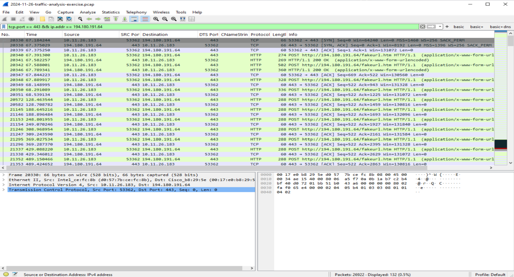

# Incident Response – NetSupport RAT (PCAP Analysis)

This project documents a structured SOC-style incident response investigation of command-and-control (C2) activity associated with NetSupport RAT using a public packet capture dataset.

The objective was to:

- Identify the infected internal host
- Validate malicious infrastructure through DNS and TLS analysis
- Confirm command-and-control (C2) beaconing behavior
- Correlate IDS alerts with packet-level inspection
- Extract actionable indicators of compromise (IOCs)

---

## Environment

- Windows 10 Virtual Machine (VirtualBox) for packet analysis
- Wireshark for network traffic inspection
- Provided IDS alert dataset for signature correlation
- Manual TCP stream inspection for application-layer validation

---

## Dataset

2024-11-26-traffic-analysis-exercise.pcap  
Source: Malware-Traffic-Analysis.net

---

## Key Findings

- Internal host **10.11.26.183** identified as infected system
- DNS resolution of `modandcrackedapk.com`
- Domain resolved to **193.42.38.139**
- Repeated HTTP POST requests to **194.180.191.64** over TCP/443
- POST requests targeting `/fakeurl.htm`
- User-Agent string: `NetSupport Manager/1.3`
- Server response header: `NetSupport Gateway/1.8 (Windows NT)`
- Repeated `CMD=POLL` requests indicating command polling behavior
- IDS alerts confirming NetSupport RAT C2 activity
- No additional infected hosts observed within capture scope

---

## Supporting Evidence

Screenshots of the investigation are available in the `/screenshots` directory and correspond to:

- Host traffic pivot (ip.addr == 10.11.26.183)
- DNS resolution of modandcrackedapk.com
- TLS Client Hello SNI validation
- HTTP POST beaconing over TCP/443
- TCP stream application-layer inspection
- IPv4 conversation statistics
- IDS alert correlation

---

### Example Evidence Snapshot

Repeated HTTP POST beaconing to 194.180.191.64:

---

## Indicators of Compromise (IOCs)

Internal Host:
- 10.11.26.183

Domains:
- modandcrackedapk.com

External IP Addresses:
- 193.42.38.139
- 194.180.191.64

Behavioral Indicators:
- TLS Client Hello with SNI: modandcrackedapk.com
- Repeated HTTP POST over TCP/443
- URI: /fakeurl.htm
- User-Agent: NetSupport Manager/1.3
- Command polling behavior (CMD=POLL)

---

## Incident Assessment

Packet-level inspection confirmed active command-and-control communication between the infected host and external infrastructure associated with NetSupport RAT.

The traffic pattern demonstrated:

- Sustained beaconing behavior
- Encrypted session establishment
- Application-layer command polling
- IDS signature alignment with observed behavior

This investigation demonstrates how DNS visibility, encrypted session metadata, TCP stream analysis, and IDS correlation can be combined to confidently identify C2 activity.

---

## Full Investigation Writeup

Structured SOC-style report available here:

https://rickjaimesdez.github.io/writeups/incident-response-mini-report/
